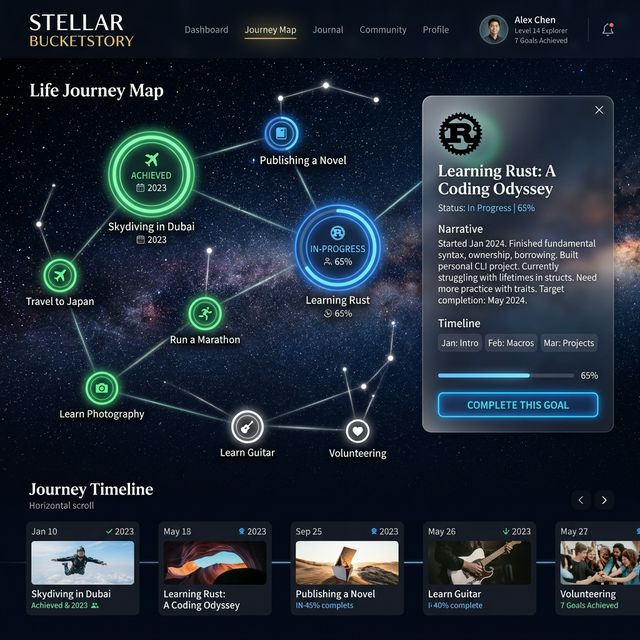

# Stellar BucketStory: Your Life's Journey on the Ledger

Stellar BucketStory is a decentralized platform for tracking your bucket list goals and the narrative progress of your life's greatest adventures.

---

## 📝 Project Description
**Stellar BucketStory** is more than just a checklist; it's a decentralized chronicle of your personal growth and achievements. Built on the **Stellar Blockchain** using the **Soroban SDK**, this application allows you to record your life goals and append a "Progress Story" to each one. Whether you're training for a marathon, learning a new language, or traveling the world, BucketStory ensures that your journey is permanently etched into the blockchain, providing a secure and immutable legacy of your accomplishments.

---

## 🔭 Project Vision
Our vision is to transform how we document our life's milestones:
- **Legacy Preservation**: Ensuring that your most meaningful stories are stored on a global, distributed ledger that outlasts centralized platforms.
- **Narrative Progress**: Moving beyond binary "done/undone" lists to focus on the story and effort behind every achievement.
- **Immutable Inspiration**: Creating a verifiable record of your journey to inspire yourself and future generations.
- **Decentralized Personal Growth**: Building tools that empower individuals to own their historical data and personal narrative.

---

## ✨ Key Features
- **Goal Initiation**: Seamlessly add new bucket list items with a title and an initial story or motivation.
- **Narrative Updates**: Use the `update_story_note` function to log progress milestones and keep your journey's story alive.
- **Immutable Achievement**: Once a goal is marked as `achieved`, it stands as a permanent testament to your perseverance.
- **Verifiable History**: Access your entire bucket list and its associated stories directly from the Stellar ledger at any time.

---

## 💎 Deployed Smartcontract Details

- **Contract ID**: `CDZARDL7W3IVNCQ3ZWBPO2LLTR7LXEXHSXRZ3XQ4APP3J2RPOL3PEEK5`
- **Network**: Stellar Testnet

---

## 🚀 Future Scope
### Short-term
- **Milestone Timestamps**: Automatically logging the block time for every story update for precise journey tracking.
- **Progress Categories**: Adding tags like #Adventure, #Skill, #Health to organize your goals.

### Mid-term
- **Story Continuity**: Implementing a linked-list of story updates instead of a single string for a true timeline feel.
- **Community Sharing**: Optional public views for your bucket list to share inspiration with others.

### Long-term
- **NFT Achievement Badges**: Minting unique soulbound tokens upon the completion of significant milestones.
- **Metaverse Integration**: Displaying your blockchain-verified bucket list in virtual galleries or personal spaces.

---
*Your life is a story. Write it on the blockchain.*
